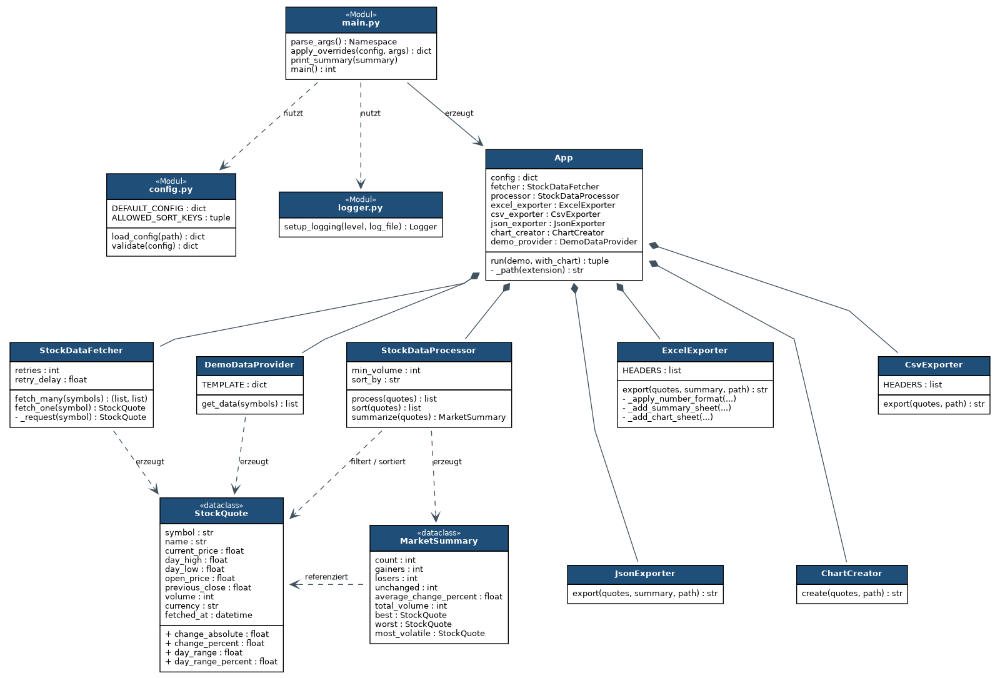
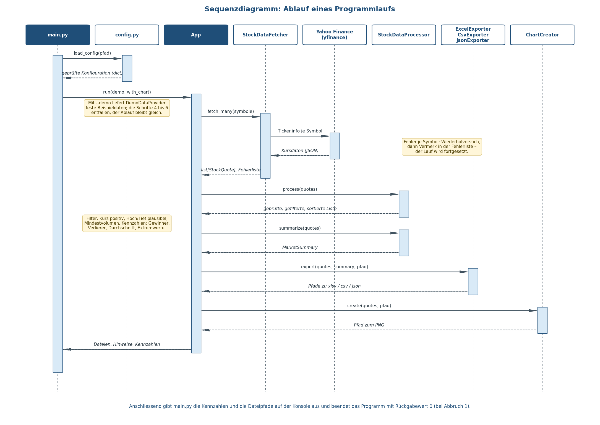

# Technische Dokumentation

**Praxisarbeit: Webautomatisierung mittels Scripting**

Automatisierter Abruf und Auswertung von Börsendaten

**Autoren:** David Stalder, Thibaud Ueckert

**Schule:** TEKO Schweizerische Fachschule AG

**Repository:** https://github.com/Tebi0526/prj_scripting_automation

## 1. Zweck und Abgrenzung

Das Programm ruft Kursdaten frei wählbarer Wertpapiere über die Yahoo-Finance-Schnittstelle ab, prüft und filtert sie, berechnet Kennzahlen und legt das Ergebnis in vier Formaten ab: als formatierte Excel-Mappe, als CSV, als JSON und als Diagramm. Es ist auf unbeaufsichtigten Betrieb ausgelegt und kann als geplante Aufgabe täglich nach Börsenschluss laufen.

Nicht Gegenstand der Arbeit sind Handelsentscheidungen, Depotverwaltung oder die Speicherung historischer Verläufe über mehrere Läufe hinweg.

## 2. Technologie und Werkzeugwahl

| Baustein | Auswahl | Begründung |
| --- | --- | --- |
| Sprache | Python 3.12 | plattformunabhängig, im Unterricht eingesetzt |
| Datenzugriff | REST-API via `yfinance` | strukturierte, typisierte Daten; kein HTML-Parsing nötig |
| Excel-Ausgabe | `openpyxl` | Formeln, bedingte Formatierung und Diagramme ohne Excel-Installation |
| Grafik | `matplotlib` | erzeugt PNG auch ohne Bildschirm (Backend `Agg`) |
| Tests | `pytest` | knappe Testschreibweise, keine Boilerplate |

API statt Scraping: Die Kursdaten sind über eine dafür vorgesehene Schnittstelle verfügbar. Ein HTML-Scraper wäre vom Seitenaufbau abhängig, müsste Zahlen aus Text herauslösen und bräche bei jedem Redesign. Scraping wäre nur die Wahl, wenn keine API existierte.

## 3. Systemvoraussetzungen und Installation

Python 3.10 oder neuer, Internetzugang für den Live-Abruf.

```
pip install -r requirements.txt
```

Abhängigkeiten: `openpyxl`, `yfinance`, `matplotlib`; für die Tests zusätzlich `pytest`.

## 4. Architektur

Das Programm ist in Schichten aufgeteilt, jede Klasse hat genau eine Aufgabe. Die Verarbeitung kennt die Datenquelle nicht und ist deshalb unabhängig von der API testbar.

| Schicht | Bausteine | Aufgabe |
| --- | --- | --- |
| Einstieg | `main.py` | Argumente, Konsolenausgabe, Rückgabewert |
| Konfiguration | `config.py`, `logger.py` | Einstellungen laden und prüfen, Protokollierung einrichten |
| Steuerung | `App` | Reihenfolge der Schritte |
| Beschaffung | `StockDataFetcher`, `DemoDataProvider` | Daten holen |
| Verarbeitung | `StockDataProcessor` | prüfen, filtern, sortieren, auswerten |
| Ausgabe | `ExcelExporter`, `CsvExporter`, `JsonExporter`, `ChartCreator` | Dateien schreiben |
| Modelle | `StockQuote`, `MarketSummary` | Daten transportieren |



## 5. Ablauf eines Programmlaufs

`main.py` liest die Argumente, lädt die Konfiguration, richtet die Protokollierung ein und übergibt an `App.run()`. Diese holt die Daten, lässt sie verarbeiten und auswerten und ruft anschliessend die vier Ausgabebausteine auf. Zum Schluss gibt `main.py` Kennzahlen und Dateipfade auf der Konsole aus.



## 6. Module im Einzelnen

### main.py

Wertet die Kommandozeile mit `argparse` aus, wobei Argumente die Werte aus der Konfigurationsdatei überschreiben. Fängt alle erwarteten Fehlerarten ab und liefert `0` bei Erfolg, `1` bei Abbruch.

### src/config.py

`load_config()` liest die JSON-Datei und ergänzt fehlende Werte aus `DEFAULT_CONFIG`. `validate()` prüft anschliessend jeden Wert und wirft bei Verstössen einen `ConfigError` mit Klartextmeldung. Symbole werden dabei auf Grossschreibung normalisiert.

### src/logger.py

Richtet zwei Ausgabekanäle ein: die Konsole mit knappem Format und eine rotierende Logdatei (`RotatingFileHandler`, maximal vier Dateien à 256 KB). Die gesprächigen Logger von `urllib3` und `matplotlib` werden gedämpft.

### src/fetcher.py

`fetch_many()` verarbeitet die Symbolliste und fängt Fehler je Symbol ab, sodass ein einzelner Ausfall den Lauf nicht beendet. `fetch_one()` wiederholt den Versuch bei Verbindungsproblemen mit Wartezeit dazwischen. `_request()` liest die Felder aus der API-Antwort, prüft sie auf Vollständigkeit und baut daraus ein `StockQuote`.

### src/demo_data.py

Liefert acht fest hinterlegte Datensätze. Der Demo-Modus läuft ohne Internet und erzeugt reproduzierbare Ausgaben – nützlich für Tests und Vorführung.

### src/processor.py

`process()` verwirft unplausible Datensätze (nicht positiver Kurs, Tageshoch unter Tagestief) und filtert nach Mindesthandelsvolumen. `sort()` sortiert nach Symbol, Tagesveränderung, Volumen oder Volatilität. `summarize()` berechnet die Kennzahlen über den gesamten Korb.

### src/exporter.py

Drei Klassen mit gleicher Aufgabe in unterschiedlichen Formaten. Der `ExcelExporter` schreibt drei Blätter: *Kursdaten* mit Excel-Formeln und bedingter Formatierung, *Kennzahlen* mit der Auswertung und *Visualisierung* mit einem eingebetteten Balkendiagramm. `CsvExporter` verwendet Semikolon und UTF-8-BOM, damit Excel die Datei ohne Importdialog korrekt öffnet. `JsonExporter` schreibt Kursdaten und Kennzahlen strukturiert für Folgeprozesse.

### src/chart.py

Erzeugt ein Balkendiagramm der Tagesveränderung, grün für Gewinne, rot für Verluste, mit Beschriftung am Balken. Das Backend `Agg` wird vor dem Import von `pyplot` gesetzt, damit die Ausgabe auch auf einem Server ohne Bildschirm funktioniert.

## 7. Datenmodell

`StockQuote` hält die Rohwerte eines Wertpapiers. Die abgeleiteten Grössen sind als Eigenschaften umgesetzt und werden bei Bedarf berechnet, statt gespeichert zu werden:

| Eigenschaft | Berechnung |
| --- | --- |
| `change_absolute` | Kurs minus Vortagesschluss |
| `change_percent` | Veränderung im Verhältnis zum Vortagesschluss, in Prozent |
| `day_range` | Tageshoch minus Tagestief |
| `day_range_percent` | Handelsspanne im Verhältnis zum Tagestief, in Prozent |

Divisionen durch null werden abgefangen und liefern `0.0`.

`MarketSummary` fasst den gesamten Korb zusammen: Anzahl, Gewinner, Verlierer, unverändert, durchschnittliche Veränderung, Gesamtvolumen sowie Verweise auf das beste, schlechteste und volatilste Papier.

## 8. Konfiguration

Datei `config.json` im Projektverzeichnis:

| Schlüssel | Bedeutung | Vorgabe |
| --- | --- | --- |
| `symbols` | Liste der Ticker-Symbole | acht Beispielwerte |
| `min_volume` | Mindesthandelsvolumen als Filter | `0` |
| `sort_by` | `symbol`, `change_percent`, `volume` oder `volatility` | `change_percent` |
| `output_dir` | Ausgabeverzeichnis | `output` |
| `basename` | Namensstamm der Dateien | `boersendaten` |
| `retries` | Wiederholversuche je Symbol | `2` |

Kommandozeilenparameter: `--config`, `--symbols`, `--output-dir`, `--min-volume`, `--sort-by`, `--demo`, `--no-chart`, `--log-level`. Sie überschreiben die Datei.

## 9. Ausgabe

Pro Lauf entstehen vier Dateien mit gemeinsamem Zeitstempel im Namen, sodass ältere Läufe erhalten bleiben:

| Datei | Inhalt |
| --- | --- |
| `boersendaten_JJJJMMTT_HHMMSS.xlsx` | drei Blätter mit Formeln, Formatierung und Diagramm |
| `... .csv` | Rohdaten, direkt in Excel lesbar |
| `... .json` | Kursdaten und Kennzahlen für Folgeprozesse |
| `... .png` | Balkendiagramm der Tagesveränderung |

Zusätzlich `output/boersendaten.log` mit dem Protokoll des Laufs.

## 10. Fehlerbehandlung

| Situation | Verhalten |
| --- | --- |
| Zeitüberschreitung oder Verbindungsabbruch | Wiederholversuch mit Wartezeit, danach Vermerk in der Fehlerliste |
| Unvollständige API-Antwort | Datensatz wird verworfen, kein Wiederholversuch |
| Fehlender Vortagesschluss | Eröffnungskurs dient als Bezugsgrösse |
| Einzelnes Symbol nicht abrufbar | Lauf wird fortgesetzt, Hinweis am Ende der Ausgabe |
| Kein einziger Datensatz | Abbruch mit Meldung und Rückgabewert 1 |
| Unplausible Werte | Datensatz wird gefiltert und protokolliert |
| Fehlerhafte Konfiguration | `ConfigError` mit Angabe des betroffenen Schlüssels |
| Ausgabepfad nicht beschreibbar | Meldung und Rückgabewert 1 |

## 11. Tests

```
python -m pytest tests -q
```

Vierzehn Tests decken ab: Berechnung der Kennzahlen inklusive Division durch null, Filterung unplausibler Werte, Volumenfilter, leere Ergebnismenge, alle Sortiervarianten samt Rückfall bei unbekanntem Kriterium, Auswertung des Korbs, Konfigurationsprüfung sowie die drei Exportformate. Sie verwenden die Demo-Daten und benötigen keinen Netzzugriff.

## 12. Geplante Ausführung

Linux, werktags um 18:10 Uhr:

```
10 18 * * 1-5 cd /pfad/zum/projekt && /usr/bin/python3 main.py >> output/cron.log 2>&1
```

Windows-Aufgabenplanung:

```
$action  = New-ScheduledTaskAction -Execute "python.exe" -Argument "main.py" -WorkingDirectory "C:\Pfad\zum\Projekt"
$trigger = New-ScheduledTaskTrigger -Daily -At 18:10
Register-ScheduledTask -TaskName "Boersendaten" -Action $action -Trigger $trigger
```

## 13. Verzeichnisstruktur

```
projekt/
├── main.py                  Einstiegspunkt
├── config.json              Konfiguration
├── requirements.txt         Abhängigkeiten
├── README.md                Kurzanleitung
├── src/
│   ├── app.py               Ablaufsteuerung
│   ├── config.py            Konfiguration laden und prüfen
│   ├── logger.py            Protokollierung
│   ├── fetcher.py           API-Abruf
│   ├── demo_data.py         Beispieldaten
│   ├── processor.py         Verarbeitung und Kennzahlen
│   ├── exporter.py          Excel, CSV, JSON
│   ├── chart.py             Diagramm
│   └── models.py            Datenmodelle
├── tests/                   Unit-Tests
├── tools/                   Skripte zur Erzeugung der Diagramme
├── docs/                    Dokumentation, Diagramme, Beispielausgaben
└── output/                  Laufzeitergebnisse (nicht versioniert)
```

## 14. Grenzen und mögliche Erweiterungen

Die Yahoo-Schnittstelle ist nicht offiziell dokumentiert; Feldnamen können sich ändern. Das Programm fängt das ab, indem es fehlende Felder erkennt und den Datensatz verwirft, statt mit falschen Werten weiterzurechnen. Kurse sind je nach Börsenplatz verzögert und eignen sich nicht für zeitkritische Auswertungen.

Naheliegende Erweiterungen: Versand des Berichts per E-Mail, Schwellenwert-Alarme bei starken Bewegungen sowie eine Datenbank, die die Läufe historisiert und Verläufe über mehrere Tage darstellbar macht.
